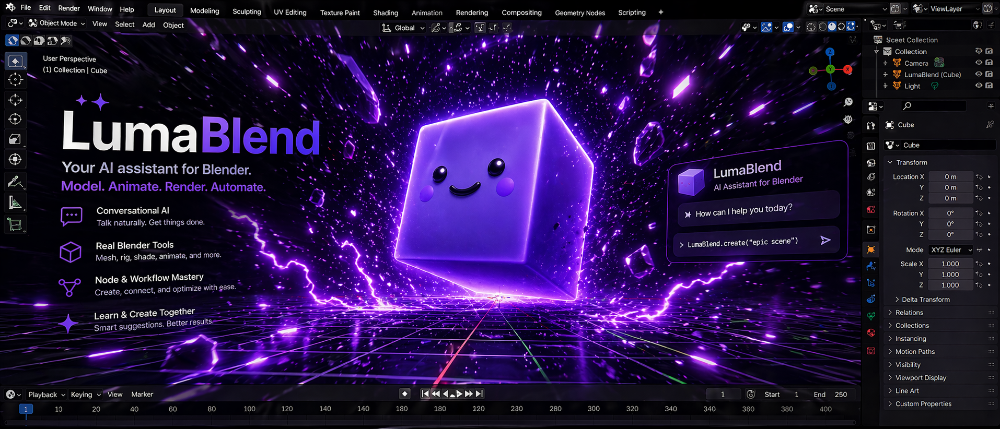
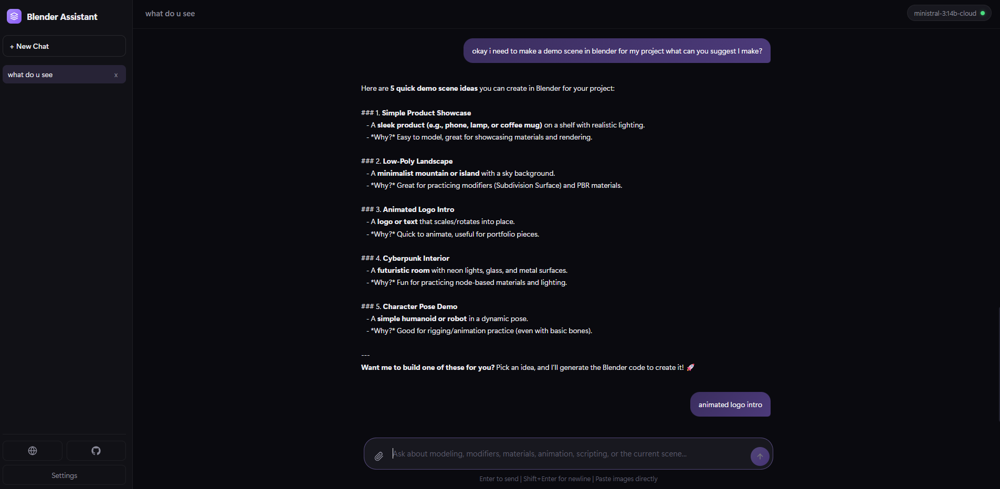
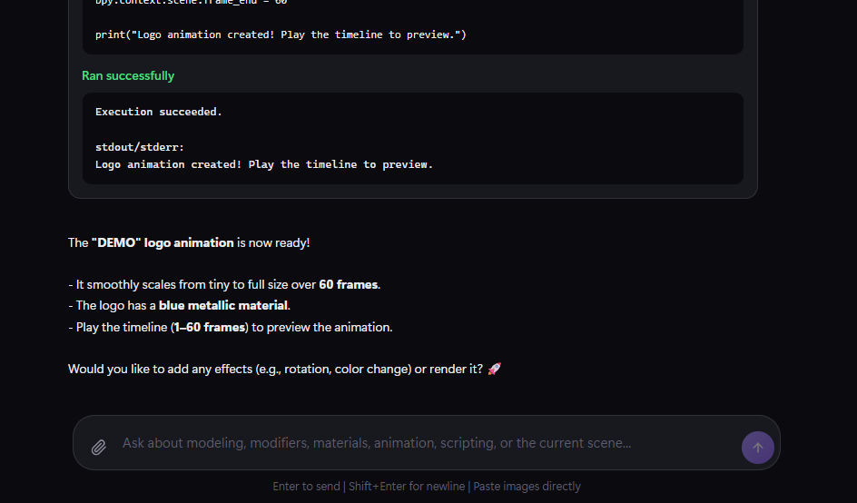
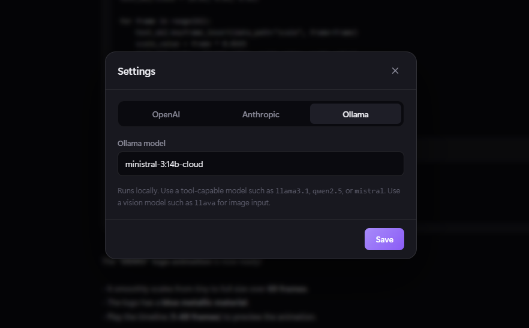

# LumaBlend

A Blender addon that opens a polished browser-based companion app for scene-aware chat, image input, and approval-based Python execution inside Blender.

The addon stays lightweight inside Blender. The full chat experience runs in your browser, while Blender keeps feeding scene context to the companion app so the model understands what you are working on.



---

## Quick Start

### 1. Download the addon

Grab the latest zip from the [Releases page](https://github.com/patmakesapps/blender-ollama/releases) - for example `blender-ollama-v0.8.2-test.zip`.

Do not unzip it. Blender installs the zip directly.

### 2. Install it in Blender

1. Open Blender.
2. Go to `Edit > Preferences > Add-ons`.
3. Click `Install...`.
4. Choose the downloaded zip.
5. Enable **Ollama Chat Assistant**.

### 3. Open the companion

1. In the 3D Viewport, press `N` to open the right sidebar.
2. Open the `Ollama` tab.
3. Click **Open Assistant**.

This starts a small local server on `http://127.0.0.1:8767` and opens the LumaBlend chat app in your default browser.

### 4. Pick a provider

Open **Settings** in the chat app sidebar and choose one of:

- **OpenAI** - paste your API key and use the default `gpt-5` model or change it.
- **Anthropic** - paste your API key and choose your Claude model.
- **Ollama** - no API key needed. Make sure Ollama is running locally and the model name matches one you have pulled.

Keys are stored locally in `~/.blender-ollama/config.json`.

---

## Screenshots

### Main Chat UI



### Composer And Layout



### Settings Modal



---

## What It Does

- Browser-based chat UI branded as **LumaBlend**
- Scene-aware prompts from the active Blender session
- SQLite-backed persistent chats in `~/.blender-ollama/chats.db`
- Image paste and image attach support in the composer
- Approval cards before model-generated Blender Python executes
- OpenAI, Anthropic, and Ollama provider support

---

## Using The App

- **+ New Chat** starts a fresh conversation.
- **Chat list** lets you reopen previous conversations.
- **Enter** sends and **Shift+Enter** inserts a newline.
- **Paste images directly** into the composer or use the paperclip button.
- **Run in Blender** cards appear when the model wants to execute Python in Blender.
- Chats persist in SQLite, so browser refreshes do not wipe them.

---

## Provider Setup

### OpenAI

1. Get a key at https://platform.openai.com/api-keys
2. Open Settings in LumaBlend.
3. Select `OpenAI`.
4. Paste the key and save.

### Anthropic

1. Get a key at https://console.anthropic.com/settings/keys
2. Open Settings in LumaBlend.
3. Select `Anthropic`.
4. Paste the key and save.

### Ollama

1. Install Ollama from https://ollama.com/
2. Pull a model, for example:

```text
ollama pull llama3.2:3b
```

3. Make sure Ollama is running.
4. In Settings, set the model name to exactly what you pulled.

For tool execution, use a tool-capable Ollama model. For image input, use a vision-capable model.

---

## How It Works

1. Blender launches `companion/server.py`.
2. The browser opens `http://127.0.0.1:8767`.
3. Blender POSTs scene context to the companion app.
4. Your conversation is stored in SQLite at `~/.blender-ollama/chats.db`.
5. If the model wants to run Blender Python, the UI shows an approval card first.
6. Approved code executes inside the active Blender session through the local executor bridge.

---

## Troubleshooting

- **The companion app did not start in time**: another process is probably using port `8767`.
- **Failed to fetch**: your API key is missing, invalid, or Ollama is not running.
- **Model not available in Ollama**: run `ollama list` and match the exact model name in Settings.
- **Chats missing**: check `~/.blender-ollama/chats.db` and make sure you launched the addon from the same user profile.
- **Python execution does nothing**: make sure Blender is still open with the addon enabled so the executor is reachable on `127.0.0.1:8766`.

---

## Notes

- The companion server is local-only and is not exposed to the public internet.
- API keys are stored in `~/.blender-ollama/config.json`.
- Chats are stored in `~/.blender-ollama/chats.db`.
- Scene context includes scene name, active object, selected objects, object count, and mode.

